# **XCO2**

## **Loading internal functions**

``` r
functions_files <- list.files('r/',full.names = T)
purrr::map(functions_files,source)
#webshot::install_phantomjs(force=TRUE)
```

## **XCO2 download and pre-processing**

### **Download**

``` r

## Before ruining this chunk, please create a data-raw folder


# url_filename <- list.files("url/",
#                             pattern = ".txt",
#                             full.names = TRUE)
# 
# urls <- read.table(url_filename) |>
#   dplyr::filter(!stringr::str_detect(V1,".pdf"))
# n_urls <- nrow(urls)
# 
# ### Download
# tictoc::tic()
# furrr::future_pmap(list(urls[,1],"input your user","your password"),my_ncdf4_download)
# tictoc::toc()
```

### **Extraction**

``` r
# files_names <- list.files("data-raw/",
#                           pattern = "nc",
#                           full.names = TRUE)
# 
# #### Extracting
# 
# xco2 <- purrr::map_df(files_names, my_ncdf4_extractor) |>
#   dplyr::mutate(
#     date = as.Date.POSIXct(time)
#   )
# dplyr::glimpse(xco2)

# ### Saving full data

# readr::write_rds(xco2,'data/xco2_full.rds')
```

### **Aggregation**

``` r
# Expand grid for brazil
#
##
# dist <- 0.5
# grid_br <- expand.grid(lon=seq(-74,
#                                -27,dist),
#                        lat=seq(-34,
#                                6,
#                                dist))
# plot(grid_br)
# 
# 
# br <- geobr::read_country(showProgress = FALSE)
# region <- geobr::read_region(showProgress = FALSE)
# 
# pol_br <- br$geom |> purrr::pluck(1) |> as.matrix()
# pol_north <- region$geom |> purrr::pluck(1) |> as.matrix()
# pol_northeast <- region$geom |> purrr::pluck(2) |> as.matrix()
# pol_southeast <- region$geom |> purrr::pluck(3) |> as.matrix()
# pol_south <- region$geom |> purrr::pluck(4) |> as.matrix()
# pol_midwest<- region$geom |> purrr::pluck(5) |> as.matrix()
# 
# # correcting poligions
# 
# pol_br <- pol_br[pol_br[,1]<=-34,]
# pol_br <- pol_br[!((pol_br[,1]>=-38.8 & pol_br[,1]<=-38.6) &
#                      (pol_br[,2]>= -19 & pol_br[,2]<= -16)),]
# 
# pol_northeast <- pol_northeast[pol_northeast[,1]<=-34,]
# pol_northeast <- pol_northeast[!((pol_northeast[,1]>=-38.7 &
#                                     pol_northeast[,1]<=-38.6) &
#                                    pol_northeast[,2]<= -15),]
# 
# pol_southeast <- pol_southeast[pol_southeast[,1]<=-30,]
# 
# 
# ### filtering expanded grid to the brazil boundries
# 
# grid_br_cut <- grid_br |>
#   dplyr::mutate(
#     flag_br = def_pol(lon,lat,pol_br),
#     flag_north = def_pol(lon,lat,pol_north),
#     flag_northeast = def_pol(lon,lat,pol_northeast),
#     flag_midwest= def_pol(lon,lat,pol_midwest),
#     flag_southeast = def_pol(lon,lat,pol_southeast),
#     flag_south = def_pol(lon,lat,pol_south)
#   ) |>
#   tidyr::pivot_longer(
#     tidyr::starts_with('flag'),
#     names_to = 'region',
#     values_to = 'flag'
#   ) |>
#   dplyr::filter(flag) |>
#   dplyr::select(lon,lat) |>
#   dplyr::group_by(lon,lat) |>
#   dplyr::summarise(
#     n_obs = dplyr::n()
#   )
# 
# plot(grid_br_cut$lon,grid_br_cut$lat)
# 
# 
# #### aggregation
# xco2df <- readr::read_rds('data/xco2_full.rds')
# 
# xco2_full_trend <- xco2df |> dplyr::mutate(
#   year =lubridate::year(date),
#   month = lubridate::month(date)
# )
# 
# max(xco2_full_trend$year)
# 
# 
# for(i in 2015:2023){
#   aux_xco2 <- xco2_full_trend |>
#     dplyr::filter(year==i)
#   vct_xco2 <- vector();dist_xco2 <- vector();
#   lon_grid <- vector();lat_grid <- vector();
#   for(k in 1:nrow(aux_xco2)){
#     d <- sqrt((aux_xco2$lon[k]-grid_br_cut$lon)^2+
#                 (aux_xco2$lat[k]-grid_br_cut$lat)^2
#     )
#     min_index <- order(d)[1]
#     vct_xco2[k] <- aux_xco2$xco2[min_index]
#     dist_xco2[k] <- d[order(d)[1]]
#     lon_grid[k] <- grid_br_cut$lon[min_index]
#     lat_grid[k] <- grid_br_cut$lat[min_index]
#   }
#   aux_xco2$dist_xco2 <- dist_xco2
#   aux_xco2$xco2_new <- vct_xco2
#   aux_xco2$lon_grid <- lon_grid
#   aux_xco2$lat_grid <- lat_grid
#   if(i == 2015){
#     xco2_full_trend_cut <- aux_xco2
#   }else{
#     xco2_full_trend_cut <- rbind(xco2_full_trend_cut,aux_xco2)
#   }
# }
# 
# 
# xco2_full_trend_cut|>
#   dplyr::mutate(
#     dist_conf = sqrt((lon - lon_grid)^2 + (lat - lat_grid)^2)
#   ) |>
#   dplyr::glimpse()
# 
# nrow(xco2_full_trend_cut |>
#        dplyr::mutate(
#          dist_conf = sqrt((lon - lon_grid)^2 + (lat - lat_grid)^2),
#          dist_bol = dist_xco2 - dist_conf
#        ) |>
#        dplyr::filter(dist_bol ==0)) == nrow(xco2_full_trend_cut)
# 
# ### Saving aggregated data
# readr::write_rds(xco2_full_trend_cut,'data/xco2_0.5deg_full_trend.rds')
```

## **Loading data and shps**

``` r
br <- geobr::read_country(showProgress = FALSE)
south_file <- list.files('South_America/',pattern = 'shp',full.names = T)
south_america <- sf::read_sf(south_file[1])
biomes <- geobr::read_biomes(showProgress = FALSE) 

xco2df <- readr::read_rds('data/xco2_0.5deg_full_trend.rds')
```

## **Data Overview**

\###**Descriptive statistics**

``` r
df_stat_desc_xco2 <- xco2df |>
  dplyr::filter(dist_xco2<0.25) |>
  dplyr::mutate(
    date = lubridate::make_date(year,month,'15')
  ) |>
  dplyr::group_by(date) |>
  dplyr::summarise(
    N = length(xco2),
    MIN = min(xco2),
    MEAN = mean(xco2),
    MEDIAN = median(xco2),
    MAX = max(xco2),
    VARIANCY  = var(xco2),
    STD_DV = sd(xco2),
    CV = 100*STD_DV/MEAN,
    SKW = agricolae::skewness(xco2),
    KRT = agricolae::kurtosis(xco2),
    )

dplyr::glimpse(df_stat_desc_xco2)
#> Rows: 101
#> Columns: 11
#> $ date     <date> 2015-01-15, 2015-02-15, 2015-03-15, 2015-04-15, 2015-05-15, …
#> $ N        <int> 4834, 3266, 3082, 3586, 6783, 14151, 22336, 39551, 27232, 120…
#> $ MIN      <dbl> 391.2517, 392.0473, 391.5403, 392.7837, 389.5954, 393.4951, 3…
#> $ MEAN     <dbl> 396.6295, 397.8624, 397.5033, 397.3391, 398.6293, 399.2813, 3…
#> $ MEDIAN   <dbl> 396.7224, 397.9582, 397.3460, 397.2065, 398.6134, 399.3093, 3…
#> $ MAX      <dbl> 401.7024, 403.9044, 403.5916, 404.4307, 404.5308, 407.0273, 4…
#> $ VARIANCY <dbl> 1.9078310, 2.1494391, 2.6131289, 3.1185877, 2.1964112, 2.0122…
#> $ STD_DV   <dbl> 1.3812426, 1.4660966, 1.6165175, 1.7659524, 1.4820294, 1.4185…
#> $ CV       <dbl> 0.3482450, 0.3684934, 0.4066677, 0.4444446, 0.3717813, 0.3552…
#> $ SKW      <dbl> -0.114600668, -0.082340999, 0.564404489, 0.591012035, 0.12079…
#> $ KRT      <dbl> 0.22704877, 0.14272224, 0.94588958, 0.79820179, 1.10703691, 0…
#DT::datatable(df_stat_desc)
```

### **Histograms**

``` r
xco2df |>
  dplyr::filter(dist_xco2<0.25 & year <2023) |>
  ggplot2::ggplot(ggplot2::aes(x=xco2)) +
  ggplot2::geom_histogram(color="black",fill="gray",
                 bins = 30) +
  ggplot2::facet_wrap(~year, scales = "free") +
  ggplot2::theme_bw()
```

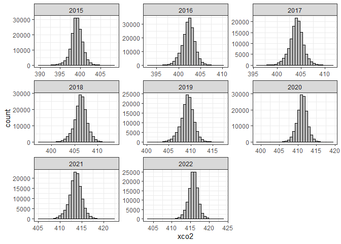<!-- -->

## **Temporal visualization**

### ***General for Brazil***

``` r

xco2df |>
  dplyr::filter(dist_xco2<0.25) |> # radius (grid cell = 0.5°)
  dplyr::filter(year %in% 2015:2022) |>
  dplyr::group_by(year,date) |>
  dplyr::summarise(xco2_mean=mean(xco2)) |>
  ggplot2::ggplot(ggplot2::aes(x=date,y=xco2_mean))+
  ggplot2::geom_point(shape=21,color="black",fill="gray") +
  ggplot2::geom_line(color="red")+
  ggplot2::geom_smooth(method = "lm") +
  ggplot2::ylim(390,420)+
  ggpubr::stat_regline_equation(ggplot2::aes(
                                  label =  paste(..eq.label.., ..rr.label..,
                                                 sep = "*plain(\",\")~~")),
                                label.y = 420) +
  ggplot2::facet_wrap(~year,scales ='free')+
  ggplot2::theme_bw()+
  ggplot2::labs(x='',y=expression('Xco'[2]~' (ppm)'),fill='' )
```

<!-- -->

``` r


# ggplot2::ggsave('img/xco2_temporal_ano.png',units="in", width=10, height=7,
#                 dpi=300)
```

### ***Rationality of beta***

``` r
xco2df_rationality <- xco2df |>
  dplyr::filter(dist_xco2<0.25) |>
  dplyr::mutate(
    lon = lon_grid,
    lat = lat_grid,
  ) |>
  dplyr::filter(lon == -50, lat ==-19) |>
  dplyr::select(-c(lon_grid,lat_grid)) |>
  dplyr::group_by(lon,lat,year,month) |>
  dplyr::summarise(
    xco2_mean= mean(xco2,na.rm=TRUE),
    xco2_sd = sd(xco2,na.rm=TRUE),
    xco2_uncertanty = mean(uncertanty),
    nobs = dplyr::n(),
    xco2_ep = xco2_sd/sqrt(nobs),
    cv = 100*xco2_sd/xco2_mean
  ) |>
  dplyr::mutate(
    date = lubridate::make_date(year,month,'15')
  )
mod <- lm(xco2_mean~x,data =xco2df_rationality |>
            dplyr::mutate(
              x = 1:dplyr::n()
            ))
xco2df_rationality |>
  dplyr::filter(lubridate::year(date)<2023) |>
  dplyr::mutate(
    x=1:dplyr::n(),
    xco2_est = mod$coefficients[1] + mod$coefficients[2]*x,
    delta=xco2_est - xco2_mean,
    xco2r = (mod$coefficients[1]-delta)-(mean(xco2_mean)-mod$coefficients[1])
  ) |>
  dplyr::group_by(date) |>
  dplyr::summarise(xco2_mean=mean(xco2r)) |>
  ggplot2::ggplot(ggplot2::aes(x=date,y=xco2_mean )) +
  ggplot2::geom_point(shape=21,color="black",fill="gray") +
  ggplot2::geom_line(color="red") +
  ggplot2::geom_smooth(method = "lm") +
  ggpubr::stat_regline_equation(ggplot2::aes(
    label =  paste(..eq.label.., ..rr.label.., sep = "*plain(\",\")~~"))) +
  ggplot2::facet_wrap(~lubridate::year(date),scales = 'free_x')+
  ggplot2::theme_bw()+
  ggplot2::xlab('Month')+
  ggplot2::ylab(expression(
    'Xco'[2][R]~' (ppm)'
  ))
```

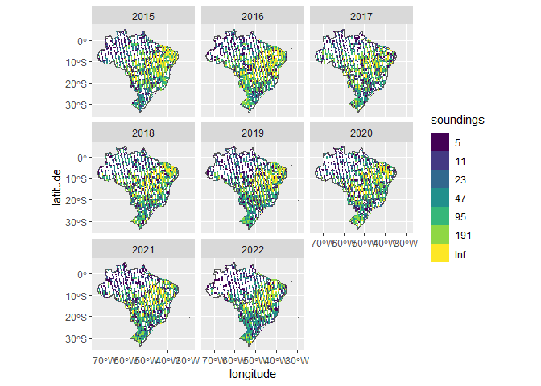<!-- -->

``` r

# ggplot2::ggsave('img/rationality_beta.png',units="in", width=8, height=6,
#                dpi=300)
```

## **Beta analisys and plots on a per-year basis by grid cell**

``` r
for(i in 2015:2022){
  
  print("===============================================")
  
  print(i)
  
  print("===============================================")
  
  xco2df_filter <- xco2df |>
    dplyr::filter(year == i) |> ## filter by year
    dplyr::filter(dist_xco2<0.25) |>
    dplyr::mutate(
      lon = lon_grid,
      lat = lat_grid,
    ) |>
    dplyr::select(-c(lon_grid,lat_grid)) |>
    dplyr::group_by(lon,lat,year,month) |> ## data month and grid cell aggregation
    dplyr::summarise(
      xco2_mean= mean(xco2,na.rm=TRUE),
      xco2_sd = sd(xco2,na.rm=TRUE),
      xco2_uncertanty = mean(uncertanty),
      nobs = dplyr::n(),
      xco2_ep = xco2_sd/sqrt(nobs),
      cv = 100*xco2_sd/xco2_mean
    ) |>
    dplyr::mutate(
      date = lubridate::make_date(year,month,'15')
    )
  
  ### general model for the year
  
  mod <- lm(xco2_mean~x,data =xco2df_filter |>
              dplyr::mutate(
                x = 1:dplyr::n()
              ))
  
  print("----------------------------")
  print("XCO2 before regionalization")
  
  plot_1 <- xco2df_filter |>
    dplyr::group_by(date) |>
    dplyr::summarise(xco2_mean=mean(xco2_mean)) |>
    ggplot2::ggplot(ggplot2::aes(x=date,y=xco2_mean )) +
    ggplot2::geom_point(shape=21,color="black",fill="gray") +
    ggplot2::geom_line(color="red") +
    ggplot2::geom_smooth(method = "lm") +
    ggpubr::stat_regline_equation(ggplot2::aes(
      label =  paste(..eq.label.., ..rr.label.., sep = "*plain(\",\")~~"))) +
    ggplot2::theme_bw()+
    ggplot2::xlab('Date')+
    ggplot2::ylab(expression(
      'Xco'[2]~' (ppm)'
    ))
  print(plot_1)
  
  #### regionalization of XCO2 
  print("----------------------------")
  print("XCO2 after regionalization")
  
  plot_2 <- xco2df_filter |>
    dplyr::mutate(
      x=1:dplyr::n(),
      xco2_est = mod$coefficients[1] + mod$coefficients[2]*x,
      delta=xco2_est - xco2_mean,
      xco2r = (mod$coefficients[1]-delta)-(mean(xco2_mean)-mod$coefficients[1])
    ) |>
    dplyr::group_by(date) |>
    dplyr::summarise(xco2_mean=mean(xco2r)) |>
    ggplot2::ggplot(ggplot2::aes(x=date,y=xco2_mean )) +
    ggplot2::geom_point(shape=21,color="black",fill="gray") +
    ggplot2::geom_line(color="red") +
    ggplot2::geom_smooth(method = "lm") +
    ggpubr::stat_regline_equation(ggplot2::aes(
      label =  paste(..eq.label.., ..rr.label.., sep = "*plain(\",\")~~"))) +
    ggplot2::theme_bw()+
    ggplot2::xlab('Date')+
    ggplot2::ylab(expression(
      'Xco'[2][R]~' (ppm)'
    ))
  print(plot_2)
  
  
  ### XCO2 regionalized
  xco2detrend <- xco2df_filter |>
    dplyr::mutate(
      x=1:dplyr::n(),
      xco2_est = mod$coefficients[1] + mod$coefficients[2]*x,
      delta=xco2_est - xco2_mean,
      xco2r = (mod$coefficients[1]-delta)-(mean(xco2_mean)-mod$coefficients[1])
    )
  xco2_aux_detrend <- xco2detrend |>
    dplyr::ungroup() |>
    dplyr::group_by(date) |>
    dplyr::summarise(
      xco2 = mean(xco2r)
    )
  
  ## general linear model
  mod_detrend <- lm(xco2 ~date,
                    data = xco2_aux_detrend )
  beta_r <-mod_detrend$coefficients[2] # regional beta
  ep <- summary(mod_detrend)$coefficients[2,2] # regional standard error
  
  ilbr <- beta_r-ep
  slbr <- beta_r+ep
  
  
  ### creating a nest object by grid cell
  xco2_nest <- xco2detrend |>
    tibble::as_tibble() |>
    dplyr::mutate(year =lubridate::year(date),
                  quarter = lubridate::quarter(date),
                  quarter_year = lubridate::make_date(year, quarter, 1)) |>
    dplyr::group_by(lon, lat,date) |>
    dplyr::summarise(xco2 = mean(xco2r, na.rm=TRUE)) |>
    dplyr::mutate(
      id_time = date
    ) |>
    dplyr::group_by(lon,lat) |>
    tidyr::nest()
  
  ### linear regression for each grid cell
  
  xco2_nest_detrend <- xco2_nest|>
    dplyr::mutate(
      beta_line = purrr::map(data,linear_reg, output="beta1"),
      p_value = purrr::map(data,linear_reg, output="p_value"),
      n_obs = purrr::map(data,linear_reg, output="n"),
      beta_error=purrr::map(data,linear_reg,output='betaerror'),
      model_error=purrr::map(data,linear_reg,output='modelerror')
    )
  
  ### creating a table
  
  xco2_aux_detrend_new <- xco2_nest_detrend |>
    dplyr::filter(n_obs > 4) |> ## criteria of minimum observation month for grid cell
    tidyr::unnest(cols = c(beta_line,beta_error,model_error)) |>
    dplyr::ungroup() |>
    dplyr::select(lon, lat, beta_line,beta_error,model_error)
  
  q3_xco2 <- xco2_aux_detrend_new |> dplyr::pull(beta_line) |> quantile(.75)
  q1_xco2 <- xco2_aux_detrend_new |> dplyr::pull(beta_line) |> quantile(.25)
  
  
  plot3 <- xco2_aux_detrend_new |>
    ggplot2::ggplot(ggplot2::aes(x=beta_line)) +
    ggplot2::geom_histogram(bins=30,
                            fill="orange",
                            color="black") +
    ggplot2::labs(x="βpixel",y="Count") +
    ggplot2::geom_vline(xintercept = q1_xco2,
                        color = "red",
                        lty=2) +
    ggplot2::geom_vline(xintercept = q3_xco2,
                        color = "red",
                        lty=2)+
    gghighlight::gghighlight(beta_line < q1_xco2 | beta_line>q3_xco2,
                             unhighlighted_params = list(
                               color = "darkgray",
                               fill = "lightgray")) +
    ggplot2::theme_minimal()
  print("----------------------------")
  print("significant βpixel histogram")
  print(plot3)
  
  plot4 <- south_america |>
    ggplot2::ggplot()+
    ggspatial::annotation_map_tile(type = 'cartolight')+
    ggplot2::geom_sf(col='grey',fill='white')+
    ggplot2::geom_sf(data=br,col='red',fill='NA')+
    ggplot2::ylim(-35,5.5)+
    ggplot2::xlim(-75,-35)+
    ggplot2::geom_tile(data=xco2_aux_detrend_new |>
                         dplyr::mutate(
                           xco2 = dplyr::case_when(
                             beta_line > q3_xco2 ~ 'Source',
                             beta_line < q1_xco2 ~'Sink',
                             .default = 'Non Significant'
                           )
                         ) |>
                         dplyr::filter(xco2!='Non Significant'),
                       ggplot2::aes(x=lon,y=lat,color=xco2,fill=xco2),
    )+
    map_theme_2()+
    ggplot2::scale_color_manual(values = c('darkgreen','darkred'))+
    ggplot2::scale_fill_manual(values = c('darkgreen','darkred'))+
    ggplot2::labs(x='Longitude',y='Latitude',
                  col=expression('Xco'[2]),fill=expression('Xco'[2]))
  print("----------------------------")
  print("significant source and sink")
  print(plot4)
  
  #### CO2 emission and assimilation
  
  plot5 <- south_america |>
    ggplot2::ggplot()+
    ggspatial::annotation_map_tile(type = 'cartolight')+
    ggplot2::geom_sf(col='grey',fill='white')+
    ggplot2::geom_sf(data=br,col='red',fill='NA')+
    ggplot2::ylim(-35,5.5)+
    ggplot2::xlim(-75,-35)+
    ggplot2::geom_tile(data=xco2_aux_detrend_new |>
                         dplyr::mutate(
                           xco2 = dplyr::case_when(
                             beta_line > q3_xco2 ~ 'Source',
                             beta_line < q1_xco2 ~'Sink',
                             .default = 'Non Significant'
                           )
                         ) |>
                         dplyr::filter(xco2!='Non Significant') |>
                         dplyr::mutate(
                           beta_molm=(beta_line*10000)*44/24.45, # beta conversion to mg mol/m3 day * 10000m ===> mg mol / m2 day
                           fco2 = beta_molm*30/1000, # montly fco2 ===> /1000 is to get in grams
                         ),
                       ggplot2::aes(x=lon,y=lat,color=fco2,fill=fco2)
    )+
    ggplot2::scale_color_viridis_c(option = "inferno")+
    ggplot2::scale_fill_viridis_c(option = "inferno")+
    map_theme_2()+
    ggplot2::labs(x='Longitude',y='Latitude',
                  col=expression('FCO'[2]~'(g'~m^-2*month^-1~')'),
                  fill=expression('FCO'[2]~'(g'~m^-2*month^-1~')')
    )
  print("----------------------------")
  print("CO2 Flux")
  print(plot5)
  
  plot6 <- south_america |>
    ggplot2::ggplot()+
    ggspatial::annotation_map_tile(type = 'cartolight')+
    ggplot2::geom_sf(col='grey',fill='white')+
    ggplot2::geom_sf(data=br,col='red',fill='NA')+
    ggplot2::ylim(-35,6)+
    ggplot2::xlim(-75,-35)+
    ggplot2::geom_tile(data=xco2_aux_detrend_new |>
                         dplyr::mutate(
                           xco2 = dplyr::case_when(
                             beta_line > q3_xco2 ~ 'Source',
                             beta_line < q1_xco2 ~'Sink',
                             .default = 'Non Significant'
                           )
                         ) |>
                         dplyr::filter(xco2!='Non Significant')|>
                         dplyr::mutate(
                           beta_molm=(beta_error*10000)*44/24.45,
                           fco2_error = beta_molm*30/1000),
                       ggplot2::aes(x=lon,y=lat,color=fco2_error,fill=fco2_error)
    )+
    ggplot2::scale_color_viridis_c(option = "inferno")+
    ggplot2::scale_fill_viridis_c(option = "inferno")+
    map_theme_2()+
    ggplot2::labs(x='Longitude',y='Latitude',
                  col=expression('FCO'[2]~'error (g'~m^-2*month^-1~')'),
                  fill=expression('FCO'[2]~'error (g'~m^-2*month^-1~')')
    )
  print("----------------------------")
  print("CO2 Flux error")
  print(plot6)
  
  print("===============================================")
  
}
#> [1] "==============================================="
#> [1] 2015
#> [1] "==============================================="
#> [1] "----------------------------"
#> [1] "XCO2 before regionalization"
```

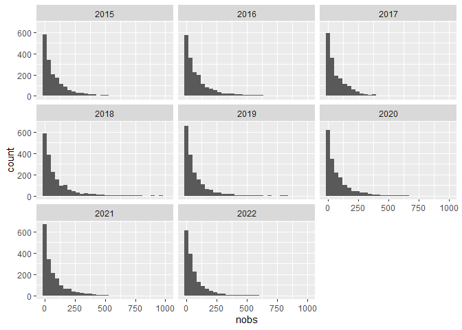<!-- -->

    #> [1] "----------------------------"
    #> [1] "XCO2 after regionalization"

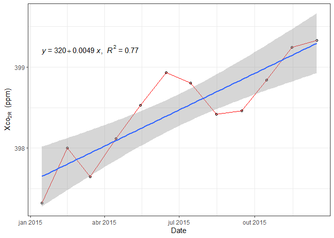<!-- -->

    #> [1] "----------------------------"
    #> [1] "significant βpixel histogram"

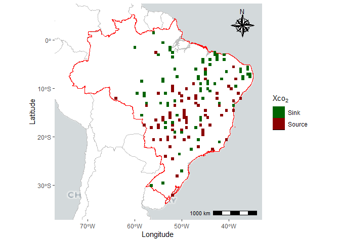<!-- -->

    #> [1] "----------------------------"
    #> [1] "significant source and sink"

<!-- -->

    #> [1] "----------------------------"
    #> [1] "CO2 Flux"

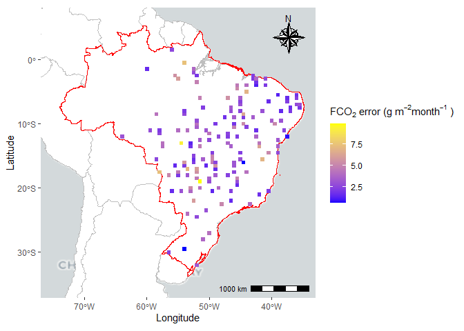<!-- -->

    #> [1] "----------------------------"
    #> [1] "CO2 Flux error"

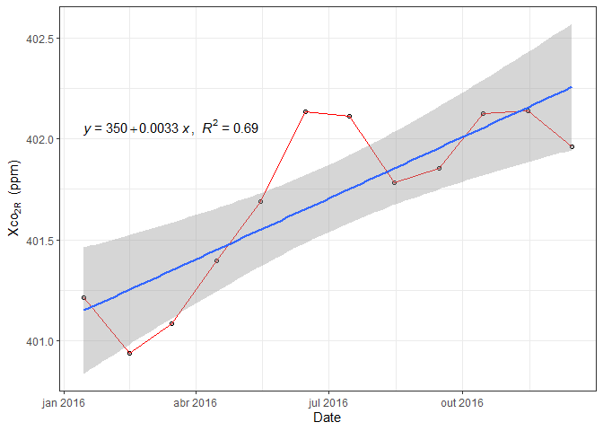<!-- -->

    #> [1] "==============================================="
    #> [1] "==============================================="
    #> [1] 2016
    #> [1] "==============================================="
    #> [1] "----------------------------"
    #> [1] "XCO2 before regionalization"

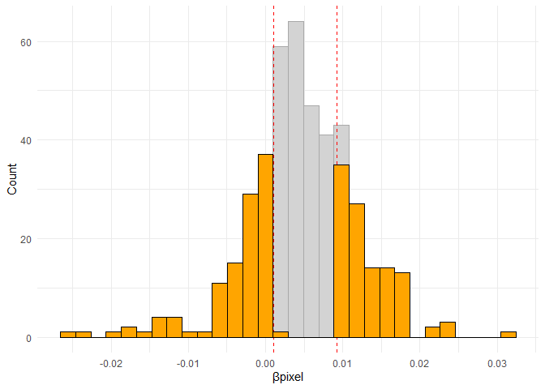<!-- -->

    #> [1] "----------------------------"
    #> [1] "XCO2 after regionalization"

<!-- -->

    #> [1] "----------------------------"
    #> [1] "significant βpixel histogram"

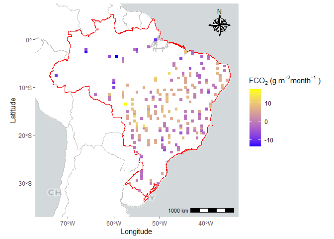<!-- -->

    #> [1] "----------------------------"
    #> [1] "significant source and sink"

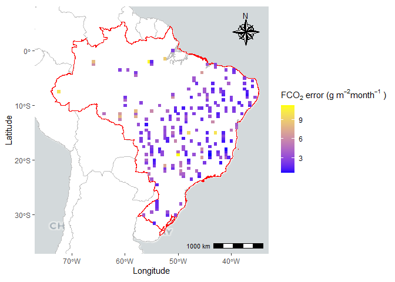<!-- -->

    #> [1] "----------------------------"
    #> [1] "CO2 Flux"

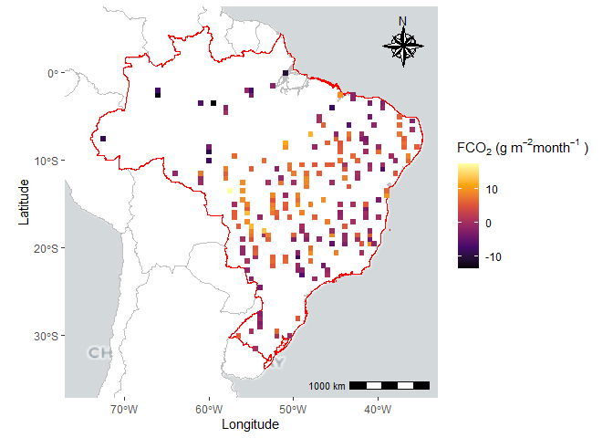<!-- -->

    #> [1] "----------------------------"
    #> [1] "CO2 Flux error"

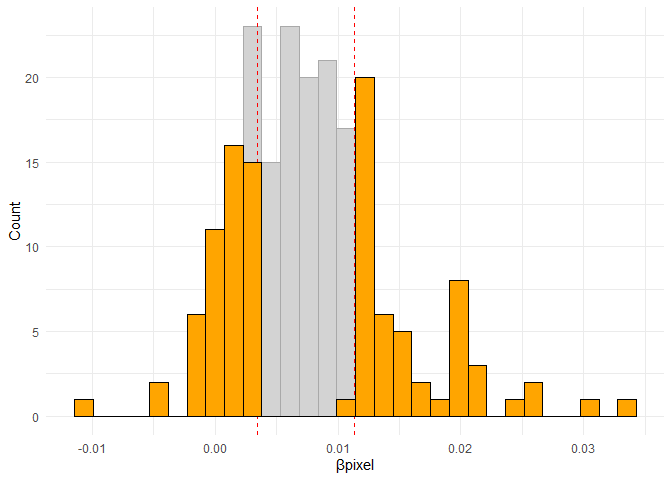<!-- -->

    #> [1] "==============================================="
    #> [1] "==============================================="
    #> [1] 2017
    #> [1] "==============================================="
    #> [1] "----------------------------"
    #> [1] "XCO2 before regionalization"

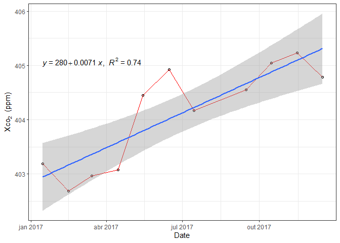<!-- -->

    #> [1] "----------------------------"
    #> [1] "XCO2 after regionalization"

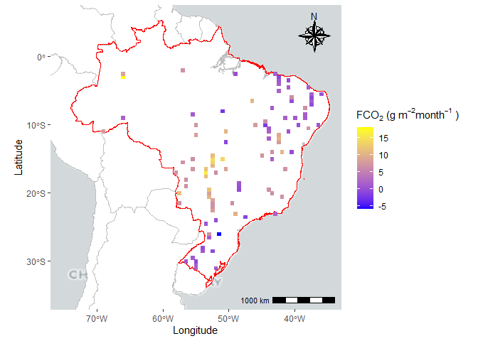<!-- -->

    #> [1] "----------------------------"
    #> [1] "significant βpixel histogram"

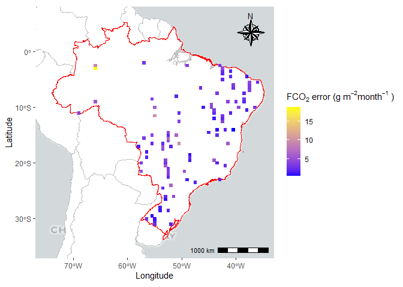<!-- -->

    #> [1] "----------------------------"
    #> [1] "significant source and sink"

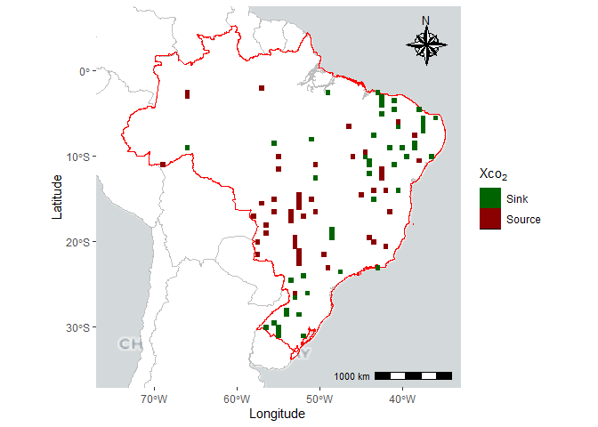<!-- -->

    #> [1] "----------------------------"
    #> [1] "CO2 Flux"

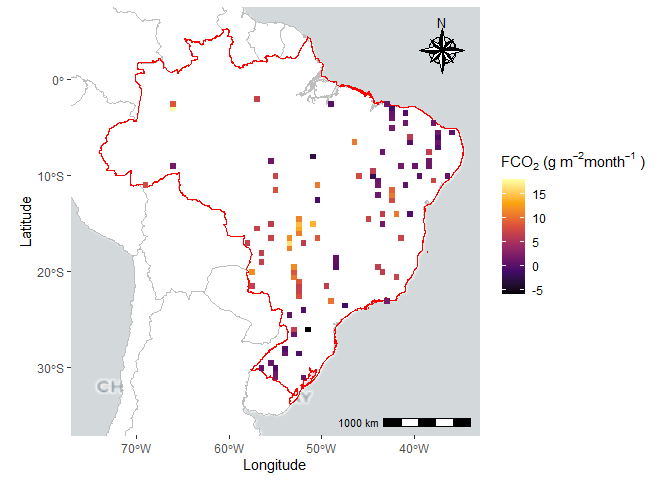<!-- -->

    #> [1] "----------------------------"
    #> [1] "CO2 Flux error"

<!-- -->

    #> [1] "==============================================="
    #> [1] "==============================================="
    #> [1] 2018
    #> [1] "==============================================="
    #> [1] "----------------------------"
    #> [1] "XCO2 before regionalization"

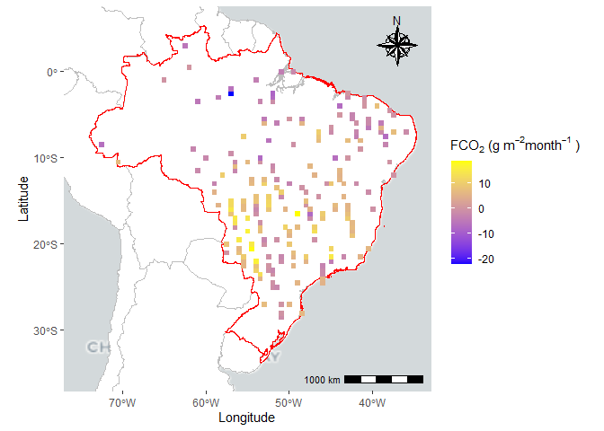<!-- -->

    #> [1] "----------------------------"
    #> [1] "XCO2 after regionalization"

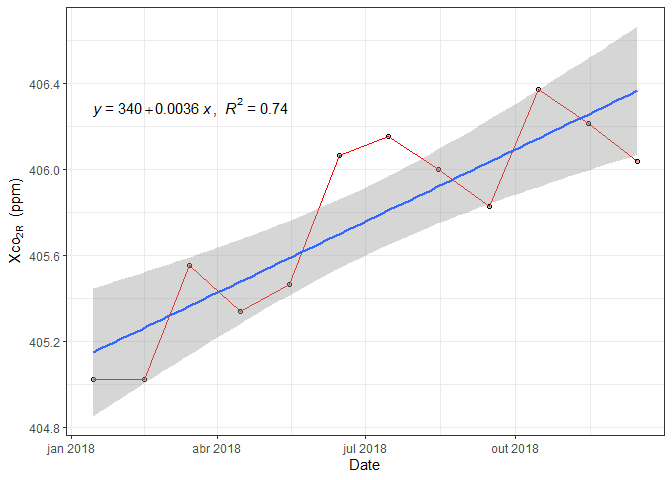<!-- -->

    #> [1] "----------------------------"
    #> [1] "significant βpixel histogram"

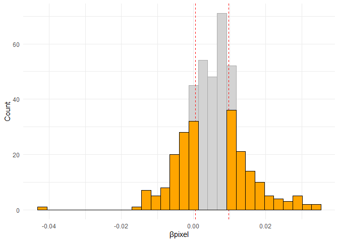<!-- -->

    #> [1] "----------------------------"
    #> [1] "significant source and sink"

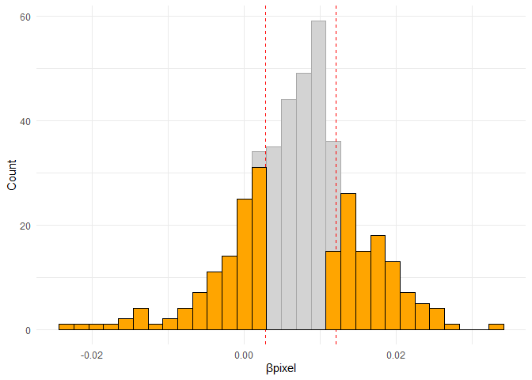<!-- -->

    #> [1] "----------------------------"
    #> [1] "CO2 Flux"

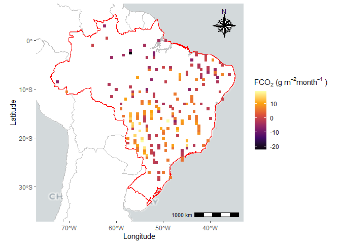<!-- -->

    #> [1] "----------------------------"
    #> [1] "CO2 Flux error"

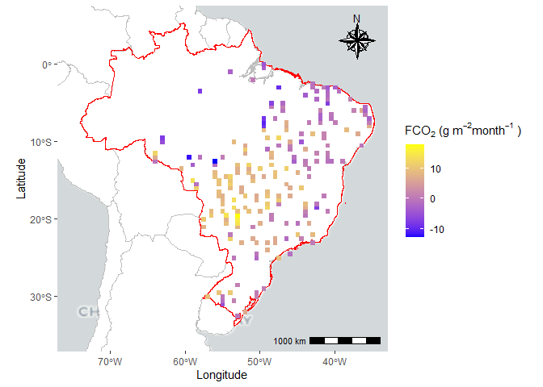<!-- -->

    #> [1] "==============================================="
    #> [1] "==============================================="
    #> [1] 2019
    #> [1] "==============================================="
    #> [1] "----------------------------"
    #> [1] "XCO2 before regionalization"

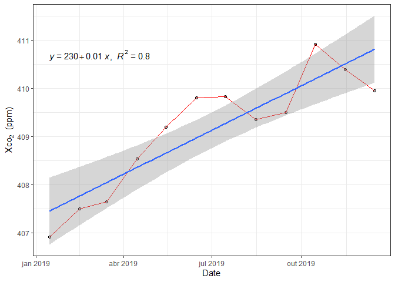<!-- -->

    #> [1] "----------------------------"
    #> [1] "XCO2 after regionalization"

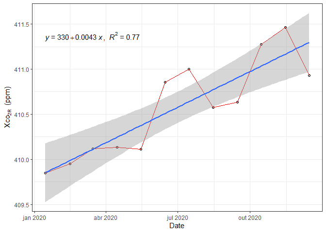<!-- -->

    #> [1] "----------------------------"
    #> [1] "significant βpixel histogram"

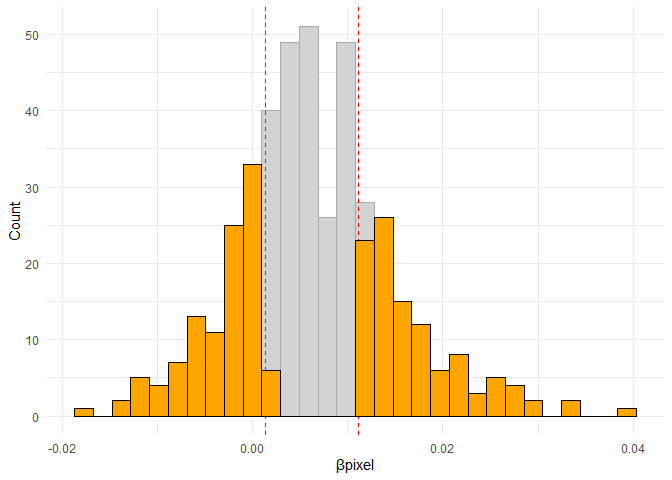<!-- -->

    #> [1] "----------------------------"
    #> [1] "significant source and sink"

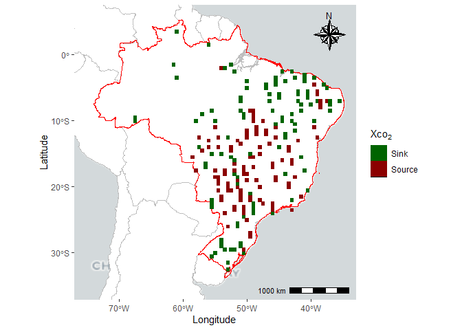<!-- -->

    #> [1] "----------------------------"
    #> [1] "CO2 Flux"

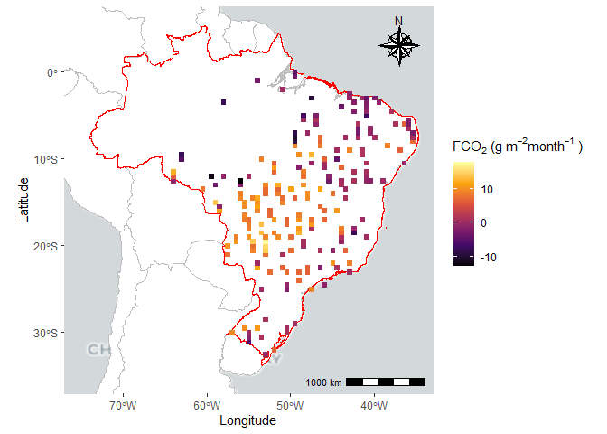<!-- -->

    #> [1] "----------------------------"
    #> [1] "CO2 Flux error"

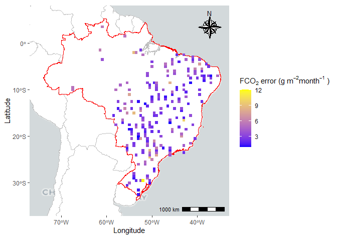<!-- -->

    #> [1] "==============================================="
    #> [1] "==============================================="
    #> [1] 2020
    #> [1] "==============================================="
    #> [1] "----------------------------"
    #> [1] "XCO2 before regionalization"

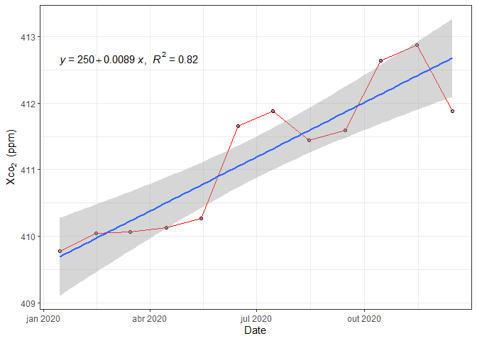<!-- -->

    #> [1] "----------------------------"
    #> [1] "XCO2 after regionalization"

<!-- -->

    #> [1] "----------------------------"
    #> [1] "significant βpixel histogram"

<!-- -->

    #> [1] "----------------------------"
    #> [1] "significant source and sink"

<!-- -->

    #> [1] "----------------------------"
    #> [1] "CO2 Flux"

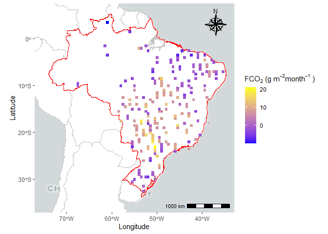<!-- -->

    #> [1] "----------------------------"
    #> [1] "CO2 Flux error"

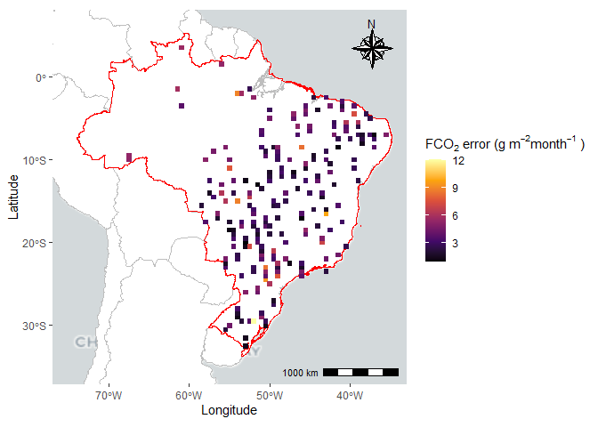<!-- -->

    #> [1] "==============================================="
    #> [1] "==============================================="
    #> [1] 2021
    #> [1] "==============================================="
    #> [1] "----------------------------"
    #> [1] "XCO2 before regionalization"

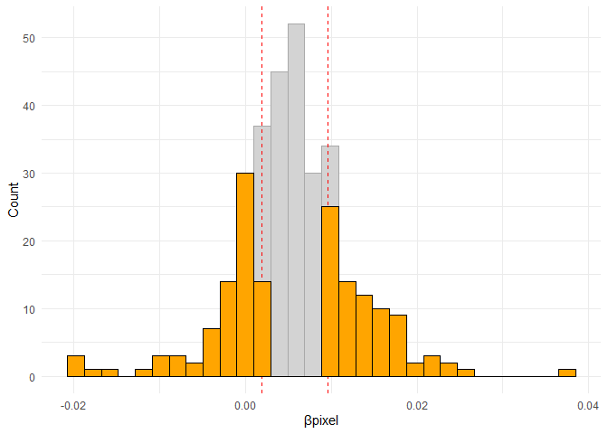<!-- -->

    #> [1] "----------------------------"
    #> [1] "XCO2 after regionalization"

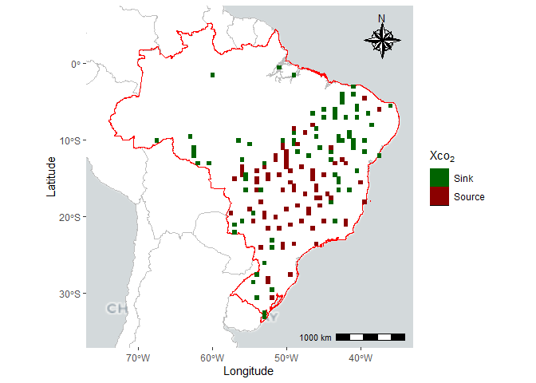<!-- -->

    #> [1] "----------------------------"
    #> [1] "significant βpixel histogram"

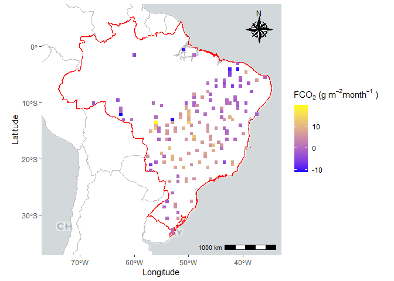<!-- -->

    #> [1] "----------------------------"
    #> [1] "significant source and sink"

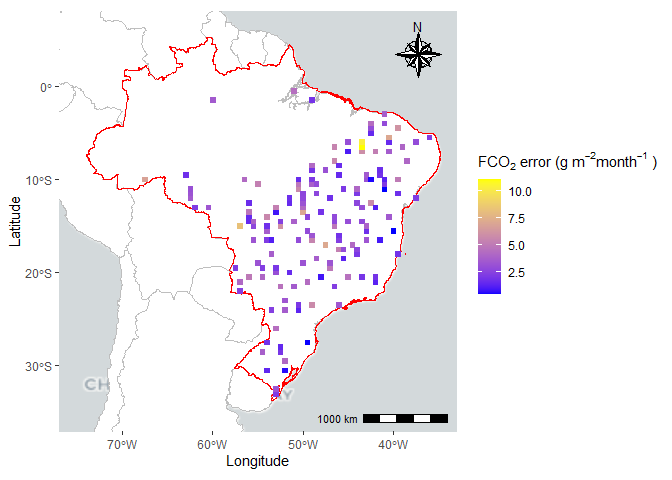<!-- -->

    #> [1] "----------------------------"
    #> [1] "CO2 Flux"

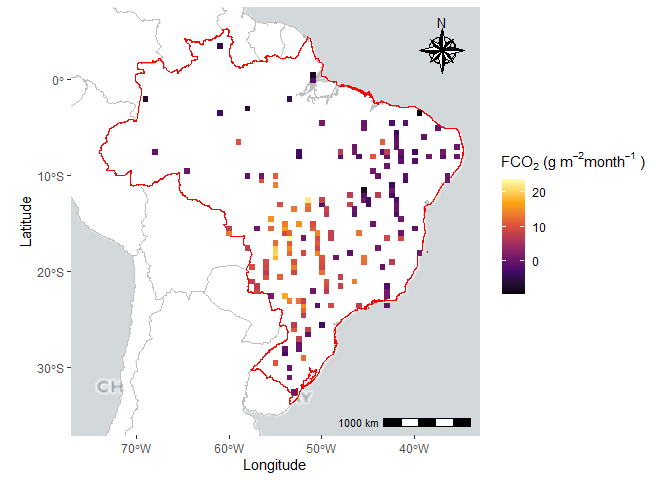<!-- -->

    #> [1] "----------------------------"
    #> [1] "CO2 Flux error"

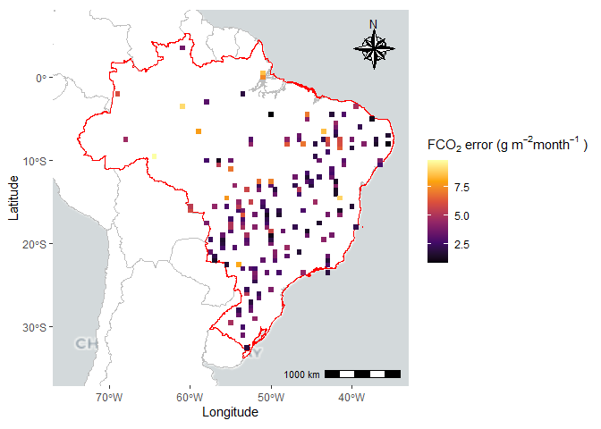<!-- -->

    #> [1] "==============================================="
    #> [1] "==============================================="
    #> [1] 2022
    #> [1] "==============================================="
    #> [1] "----------------------------"
    #> [1] "XCO2 before regionalization"

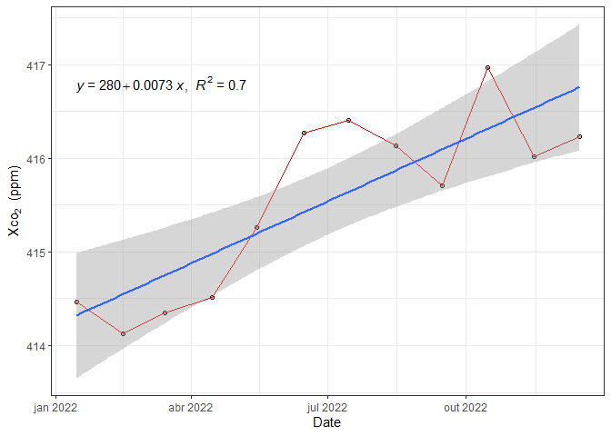<!-- -->

    #> [1] "----------------------------"
    #> [1] "XCO2 after regionalization"

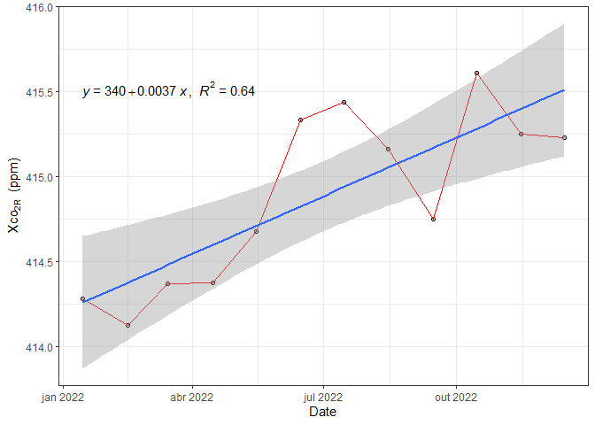<!-- -->

    #> [1] "----------------------------"
    #> [1] "significant βpixel histogram"

<!-- -->

    #> [1] "----------------------------"
    #> [1] "significant source and sink"

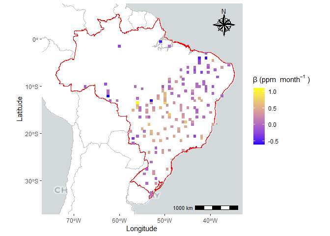<!-- -->

    #> [1] "----------------------------"
    #> [1] "CO2 Flux"

<!-- -->

    #> [1] "----------------------------"
    #> [1] "CO2 Flux error"

<!-- -->

    #> [1] "==============================================="

## **Creating a unique dataframe**

``` r
for(i in 2015:2022){
  if(i == 2015){
    
    xco2df_filter <- xco2df |>
      dplyr::filter(year == i) |> ## filter by year
      dplyr::filter(dist_xco2<0.25) |>
      dplyr::mutate(
        lon = lon_grid,
        lat = lat_grid,
      ) |>
      dplyr::select(-c(lon_grid,lat_grid)) |>
      dplyr::group_by(lon,lat,year,month) |> ## data month and grid cell aggregation
      dplyr::summarise(
        xco2_mean= mean(xco2,na.rm=TRUE),
        xco2_sd = sd(xco2,na.rm=TRUE),
        xco2_uncertanty = mean(uncertanty),
        nobs = dplyr::n(),
        xco2_ep = xco2_sd/sqrt(nobs),
        cv = 100*xco2_sd/xco2_mean
      ) |>
      dplyr::mutate(
        date = lubridate::make_date(year,month,'15')
      )
    
    ### general model for the year
    
    mod <- lm(xco2_mean~x,data =xco2df_filter |>
                dplyr::mutate(
                  x = 1:dplyr::n()
                ))
    
    
    #### regionalization of XCO2 
    xco2detrend <- xco2df_filter |>
      dplyr::mutate(
        x=1:dplyr::n(),
        xco2_est = mod$coefficients[1] + mod$coefficients[2]*x,
        delta=xco2_est - xco2_mean,
        xco2r = (mod$coefficients[1]-delta)-(mean(xco2_mean)-mod$coefficients[1])
      )
    xco2_aux_detrend <- xco2detrend |>
      dplyr::ungroup() |>
      dplyr::group_by(date) |>
      dplyr::summarise(
        xco2 = mean(xco2r)
      )
    
    ## general linear model
    mod_detrend <- lm(xco2 ~date,
                      data = xco2_aux_detrend )
    beta_r <-mod_detrend$coefficients[2] # regional beta
    ep <- summary(mod_detrend)$coefficients[2,2] # regional standard error
    
    ilbr <- beta_r-ep
    slbr <- beta_r+ep
    
    
    ### creating a nest object by grid cell
    xco2_nest <- xco2detrend |>
      tibble::as_tibble() |>
      dplyr::mutate(year =lubridate::year(date),
                    quarter = lubridate::quarter(date),
                    quarter_year = lubridate::make_date(year, quarter, 1)) |>
      dplyr::group_by(lon, lat,date) |>
      dplyr::summarise(xco2 = mean(xco2r, na.rm=TRUE)) |>
      dplyr::mutate(
        id_time = date
      ) |>
      dplyr::group_by(lon,lat) |>
      tidyr::nest()
    
    ### linear regression for each grid cell
    
    xco2_nest_detrend <- xco2_nest|>
      dplyr::mutate(
        beta_line = purrr::map(data,linear_reg, output="beta1"),
        p_value = purrr::map(data,linear_reg, output="p_value"),
        n_obs = purrr::map(data,linear_reg, output="n"),
        beta_error=purrr::map(data,linear_reg,output='betaerror'),
        model_error=purrr::map(data,linear_reg,output='modelerror')
      )
    
    ### creating a table
    
    xco2_aux_detrend_new <- xco2_nest_detrend |>
      dplyr::filter(n_obs > 4) |> ## criteria of minimum observation month for grid cell
      tidyr::unnest(cols = c(beta_line,beta_error,model_error)) |>
      dplyr::ungroup() |>
      dplyr::select(lon, lat, beta_line,beta_error,model_error) |> 
      dplyr::mutate(year=i)
    
    q3_xco2 <- xco2_aux_detrend_new |> dplyr::pull(beta_line) |> quantile(.75)
    q1_xco2 <- xco2_aux_detrend_new |> dplyr::pull(beta_line) |> quantile(.25)
    
    dfall <- xco2_aux_detrend_new |> dplyr::mutate(
      xco2 = dplyr::case_when(
        beta_line > q3_xco2 ~ 'Source',
        beta_line < q1_xco2 ~'Sink',
        .default = 'Non Significant'
      )
    )
  }else{
    xco2df_filter <- xco2df |>
      dplyr::filter(year == i) |> ## filter by year
      dplyr::filter(dist_xco2<0.25) |>
      dplyr::mutate(
        lon = lon_grid,
        lat = lat_grid,
      ) |>
      dplyr::select(-c(lon_grid,lat_grid)) |>
      dplyr::group_by(lon,lat,year,month) |> ## data month and grid cell aggregation
      dplyr::summarise(
        xco2_mean= mean(xco2,na.rm=TRUE),
        xco2_sd = sd(xco2,na.rm=TRUE),
        xco2_uncertanty = mean(uncertanty),
        nobs = dplyr::n(),
        xco2_ep = xco2_sd/sqrt(nobs),
        cv = 100*xco2_sd/xco2_mean
      ) |>
      dplyr::mutate(
        date = lubridate::make_date(year,month,'15')
      )
    
    ### general model for the year
    
    mod <- lm(xco2_mean~x,data =xco2df_filter |>
                dplyr::mutate(
                  x = 1:dplyr::n()
                ))
    
    
    #### regionalization of XCO2 
    xco2detrend <- xco2df_filter |>
      dplyr::mutate(
        x=1:dplyr::n(),
        xco2_est = mod$coefficients[1] + mod$coefficients[2]*x,
        delta=xco2_est - xco2_mean,
        xco2r = (mod$coefficients[1]-delta)-(mean(xco2_mean)-mod$coefficients[1])
      )
    xco2_aux_detrend <- xco2detrend |>
      dplyr::ungroup() |>
      dplyr::group_by(date) |>
      dplyr::summarise(
        xco2 = mean(xco2r)
      )
    
    ## general linear model
    mod_detrend <- lm(xco2 ~date,
                      data = xco2_aux_detrend )
    beta_r <-mod_detrend$coefficients[2] # regional beta
    ep <- summary(mod_detrend)$coefficients[2,2] # regional standard error
    
    ilbr <- beta_r-ep
    slbr <- beta_r+ep
    
    
    ### creating a nest object by grid cell
    xco2_nest <- xco2detrend |>
      tibble::as_tibble() |>
      dplyr::mutate(year =lubridate::year(date),
                    quarter = lubridate::quarter(date),
                    quarter_year = lubridate::make_date(year, quarter, 1)) |>
      dplyr::group_by(lon, lat,date) |>
      dplyr::summarise(xco2 = mean(xco2r, na.rm=TRUE)) |>
      dplyr::mutate(
        id_time = date
      ) |>
      dplyr::group_by(lon,lat) |>
      tidyr::nest()
    
    ### linear regression for each grid cell
    
    xco2_nest_detrend <- xco2_nest|>
      dplyr::mutate(
        beta_line = purrr::map(data,linear_reg, output="beta1"),
        p_value = purrr::map(data,linear_reg, output="p_value"),
        n_obs = purrr::map(data,linear_reg, output="n"),
        beta_error=purrr::map(data,linear_reg,output='betaerror'),
        model_error=purrr::map(data,linear_reg,output='modelerror')
      )
    
    ### creating a table
    
    xco2_aux_detrend_new <- xco2_nest_detrend |>
      dplyr::filter(n_obs > 4) |> ## criteria of minimum observation month for grid cell
      tidyr::unnest(cols = c(beta_line,beta_error,model_error)) |>
      dplyr::ungroup() |>
      dplyr::select(lon, lat, beta_line,beta_error,model_error) |> 
      dplyr::mutate(year=i)
    
    q3_xco2 <- xco2_aux_detrend_new |> dplyr::pull(beta_line) |> quantile(.75)
    q1_xco2 <- xco2_aux_detrend_new |> dplyr::pull(beta_line) |> quantile(.25)
    
    dfall_aux <- xco2_aux_detrend_new |> dplyr::mutate(
      xco2 = dplyr::case_when(
        beta_line > q3_xco2 ~ 'Source',
        beta_line < q1_xco2 ~'Sink',
        .default = 'Non Significant'
      )
    )
    
    dfall <- rbind(dfall,dfall_aux)
  }
}


#### saving the file

# writexl::write_xlsx(dfall |>
#                       dplyr::filter(xco2!='NonSignificant') |>
#                       dplyr::mutate(
#                          beta_molm=(10000*beta_line)*44/24.45,
#                          beta_fco2 = beta_molm*30/1000,
#                          beta_molm_erro=(10000*beta_error)*44/24.45,
#                          betaerror_fco2 = beta_molm_erro*30/1000
#                        ),
#                     "output/beta_significant.xlsx")
```

### **Plotting all beta**

``` r
dfall |> 
  ggplot2::ggplot(ggplot2::aes(x=beta_line*30, y=as.character(year),
                               col=as.character(year), fill=as.character(year)))+
  ggridges::geom_density_ridges(alpha=.2)+
  ggplot2::geom_vline(xintercept =dfall |>
                        dplyr::summarise(b=median(beta_line)) |>
                        dplyr::pull(b)*30, linetype='dashed', color='black')+
  ggplot2::scale_color_viridis_d()+
  ggplot2::scale_fill_viridis_d()+
  #ggplot2::facet_wrap(~xco2,scales = 'free_x')+
  ggplot2::theme_bw()+
  ggplot2::labs(x=expression('βxco'[2]~'(ppm month'^-1~')'),y='',col='',fill='')
```

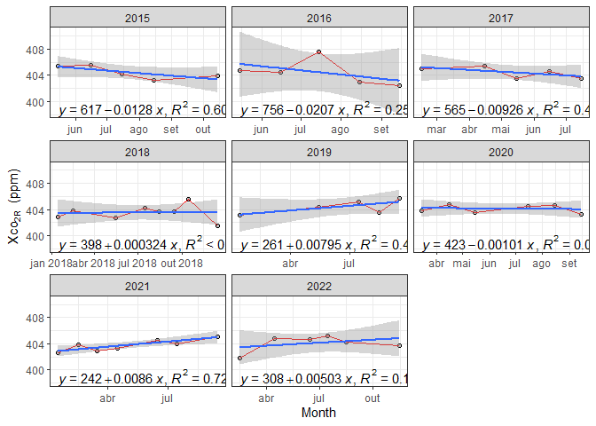<!-- -->

### **Avegerage CO2 balance for Brazil**

``` r
dfall |>
  dplyr::filter(xco2!='Non Significant') |> 
  dplyr::mutate(
    beta_molm=(10000*beta_line)*44/24.45, ## ppm to mg/m2 day (10000m is the column)
    beta_fco2 = beta_molm*30/1000, ## mg mol/m2 day ===> g CO2 month^-1 
    beta_molm_erro=(10000*beta_error)*44/24.45,
    betaerror_fco2 = beta_molm_erro*30/1000
  ) |> 
  dplyr::group_by(year) |>
  dplyr::summarise(
    fco2=mean(beta_fco2),
    fco2err=mean(betaerror_fco2),
    effective_balance = sum(12*beta_fco2*(55000^2))/1e15, ## 12 is month 55000^2 is the grid cell area in m^2 
    mean_balance = 12*fco2*8510000000000/1e15,## 12 is month 8.51e12 is brazil's area in m^2 
    mean_error = 12*fco2err*8510000000000/1e15
  ) |>
  ggplot2::ggplot(ggplot2::aes(x=year,y=mean_balance,
                               ymax=mean_balance+mean_error,
                               ymin=mean_balance))+
  ggplot2::geom_col()+
  ggplot2::geom_errorbar()+
  ggplot2::labs(
    x='',
    y=expression('CO'[2]~' Balance (Pg)')
  )+
  ggplot2::theme_bw()
```

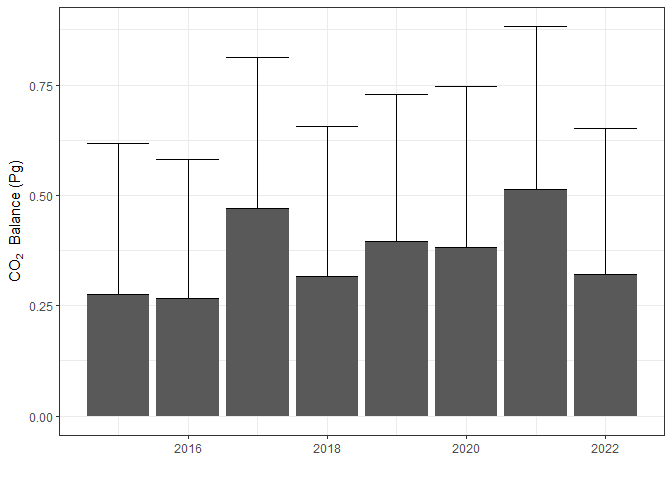<!-- -->

### **All CO2 sources and sinks**

``` r
south_america |>
  ggplot2::ggplot()+
  ggspatial::annotation_map_tile(type = "cartolight")+
  ggplot2::geom_sf(col='grey',fill='white')+
  ggplot2::geom_sf(data=br,col='red',fill='NA')+
  ggplot2::ylim(-35,5.5)+
  ggplot2::xlim(-75,-35)+
  ggplot2::geom_tile(data=dfall |>
                       dplyr::filter(xco2!='Non Significant'),
                     ggplot2::aes(x=lon,y=lat,color=xco2,fill=xco2),
  )+
  ggplot2::facet_wrap(~year)+
  ggplot2::theme(axis.text = ggplot2::element_text(size=12),
                 axis.title = ggplot2::element_text(size=20),
                 text = ggplot2::element_text(size=20)
                 )+
  map_theme_2()+
  ggplot2::scale_color_manual(values = c('darkgreen','darkred'))+
  ggplot2::scale_fill_manual(values = c('darkgreen','darkred'))+
  ggplot2::labs(x='Longitude',y='Latitude',
                col=expression('Xco'[2]),fill=expression('Xco'[2]))
```

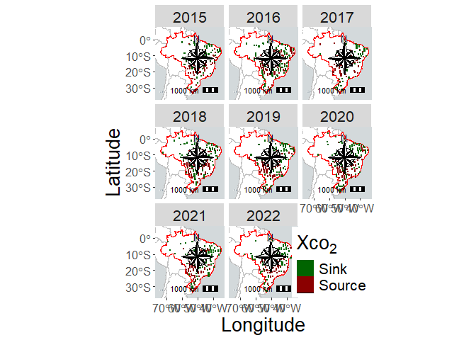<!-- -->

``` r

# ggplot2::ggsave('img/xco2_identification_all.png',units="in", width=11, height=11,
#                dpi=300)
```

### **All FCO2**

``` r
south_america |>
  ggplot2::ggplot()+
  ggspatial::annotation_map_tile(type = 'cartolight')+
  ggplot2::geom_sf(col='grey',fill='white')+
  ggplot2::geom_sf(data=br,col='red',fill='NA')+
  ggplot2::ylim(-35,5.5)+
  ggplot2::xlim(-75,-35)+
  ggplot2::geom_tile(data=dfall |>
                       dplyr::filter(xco2!='Non Significant')|> 
                       dplyr::mutate(
                         beta_molm=(10000*beta_line)*44/24.45, 
                         beta_fco2 = beta_molm*30/1000, 
                         beta_molm_erro=(10000*beta_error)*44/24.45,
                         betaerror_fco2 = beta_molm_erro*30/1000
                       ), 
                     ggplot2::aes(x=lon,y=lat,color=beta_fco2,fill=beta_fco2),
  )+
  ggplot2::facet_wrap(~year)+
  ggplot2::theme(axis.text = ggplot2::element_text(size=12),
                 axis.title = ggplot2::element_text(size=20),
                 text = ggplot2::element_text(size=20)
  )+
  map_theme_2()+
  ggplot2::scale_color_viridis_c(option = "inferno")+
  ggplot2::scale_fill_viridis_c(option = "inferno")+
  ggplot2::labs(x='Longitude',y='Latitude',
                col=expression('FCO'[2]),
                fill=expression('FCO'[2])
  )
```

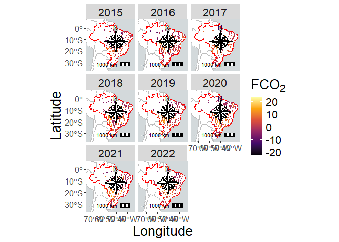<!-- -->

``` r

# ggplot2::ggsave('img/xco2_fco2_all.png',units="in", width=11, height=11,
#                 dpi=300)
```

### **All FCO2 errors**

``` r
south_america |>
  ggplot2::ggplot()+
  ggspatial::annotation_map_tile(type = 'cartolight')+
  ggplot2::geom_sf(col='grey',fill='white')+
  ggplot2::geom_sf(data=br,col='red',fill='NA')+
  ggplot2::ylim(-35,5.5)+
  ggplot2::xlim(-75,-35)+
  ggplot2::geom_tile(data=dfall |>
                       dplyr::filter(xco2!='Non Significant')|> 
                       dplyr::mutate(
                         beta_molm=(10000*beta_line)*44/24.45, 
                         beta_fco2 = beta_molm*30/1000, 
                         beta_molm_erro=(10000*beta_error)*44/24.45,
                         betaerror_fco2 = beta_molm_erro*30/1000
                       ), 
                     ggplot2::aes(x=lon,y=lat,color=betaerror_fco2,fill=betaerror_fco2),
  )+
  ggplot2::facet_wrap(~year)+
  ggplot2::theme(axis.text = ggplot2::element_text(size=12),
                 axis.title = ggplot2::element_text(size=20),
                 text = ggplot2::element_text(size=20)
  )+
  map_theme_2()+
  ggplot2::scale_color_viridis_c(option = "inferno")+
  ggplot2::scale_fill_viridis_c(option = "inferno")+
  ggplot2::labs(x='Longitude',y='Latitude',
                col=expression(epsilon~'FCO'[2]),
                fill=expression(epsilon~'FCO'[2])
  )
```

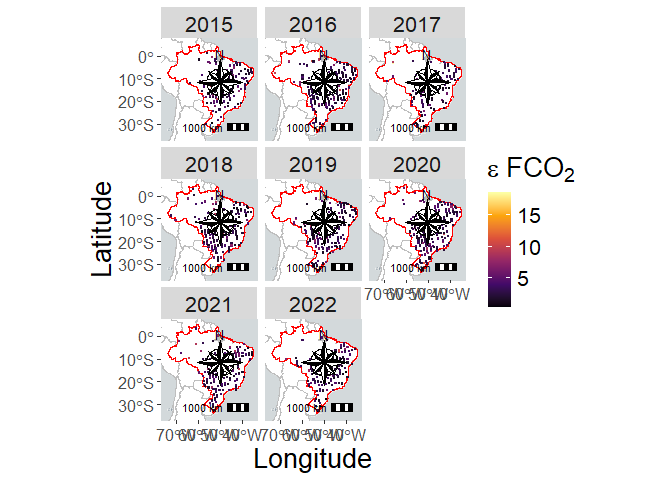<!-- -->

``` r
# ggplot2::ggsave('img/xco2_fco2_erro_all.png',units="in", width=11, height=11,
#                 dpi=300)
```

# **SIF**

## **Loading internal functions**

``` r
functions_files <- list.files('r/',full.names = T)
purrr::map(functions_files,source)
#webshot::install_phantomjs(force=TRUE)
```

## **SIF download and pre-processing**

### **Download**

``` r
## Before ruining this chunk, please create a data-raw folder on SIF folder
### SIF/data-raw/

# url_filename <- list.files("SIF/url/",
#                             pattern = ".txt",
#                             full.names = TRUE)
# 
# urls <- read.table(url_filename) |>
#   dplyr::filter(!stringr::str_detect(V1,".pdf"))
# n_urls <- nrow(urls)
# 
# ### Download
# tictoc::tic()
# furrr::future_pmap(list(urls[,1],"input your user","your password"),my_sif_download)
# tictoc::toc()
```

### **Extraction**

``` r
# files_names <- list.files("SIF/data-raw/",
#                           pattern = "nc",
#                           full.names = TRUE)
# 
# #### Extracting
# 
# sif_df <- purrr::map_df(files_names, my_sif_extractor)
# dplyr::glimpse(xco2)
# 
# readr::write_rds(sif_df,'SIF/data/sif_full.rds')
```

### **Aggregation**

``` r
# Expand grid for brazil
#
##
# dist <- 0.5
# grid_br <- expand.grid(lon=seq(-74,
#                                -27,dist),
#                        lat=seq(-34,
#                                6,
#                                dist))
# plot(grid_br)
# 
# 
# br <- geobr::read_country(showProgress = FALSE)
# region <- geobr::read_region(showProgress = FALSE)
# 
# pol_br <- br$geom |> purrr::pluck(1) |> as.matrix()
# pol_north <- region$geom |> purrr::pluck(1) |> as.matrix()
# pol_northeast <- region$geom |> purrr::pluck(2) |> as.matrix()
# pol_southeast <- region$geom |> purrr::pluck(3) |> as.matrix()
# pol_south <- region$geom |> purrr::pluck(4) |> as.matrix()
# pol_midwest<- region$geom |> purrr::pluck(5) |> as.matrix()
# 
# # correcting poligions
# 
# pol_br <- pol_br[pol_br[,1]<=-34,]
# pol_br <- pol_br[!((pol_br[,1]>=-38.8 & pol_br[,1]<=-38.6) &
#                      (pol_br[,2]>= -19 & pol_br[,2]<= -16)),]
# 
# pol_northeast <- pol_northeast[pol_northeast[,1]<=-34,]
# pol_northeast <- pol_northeast[!((pol_northeast[,1]>=-38.7 &
#                                     pol_northeast[,1]<=-38.6) &
#                                    pol_northeast[,2]<= -15),]
# 
# pol_southeast <- pol_southeast[pol_southeast[,1]<=-30,]
# 
# 
# ### filtering expanded grid to the brazil boundries
# 
# grid_br_cut <- grid_br |>
#   dplyr::mutate(
#     flag_br = def_pol(lon,lat,pol_br),
#     flag_north = def_pol(lon,lat,pol_north),
#     flag_northeast = def_pol(lon,lat,pol_northeast),
#     flag_midwest= def_pol(lon,lat,pol_midwest),
#     flag_southeast = def_pol(lon,lat,pol_southeast),
#     flag_south = def_pol(lon,lat,pol_south)
#   ) |>
#   tidyr::pivot_longer(
#     tidyr::starts_with('flag'),
#     names_to = 'region',
#     values_to = 'flag'
#   ) |>
#   dplyr::filter(flag) |>
#   dplyr::select(lon,lat) |>
#   dplyr::group_by(lon,lat) |>
#   dplyr::summarise(
#     n_obs = dplyr::n()
#   )
# 
# plot(grid_br_cut$lon,grid_br_cut$lat)
# 
# 
# #### aggregation


# sifdf <- readr::read_rds('SIF/data/sif_full.rds')
# 
# sif_full <- sifdf |> dplyr::mutate(
#   date=lubridate::as_datetime(time,origin='1990-01-01 00:00:00 UTC'),
#   date = lubridate::as_date(date),
#   year =lubridate::year(date),
#   month = lubridate::month(date)
# )
# 
# max(sif_full$year)
# 
# 
# for(i in 2015:2023){
#   aux_sif <- sif_full |>
#     dplyr::filter(year==i)
#   vct_sif <- vector();dist_sif <- vector();
#   lon_grid <- vector();lat_grid <- vector();
#   for(k in 1:nrow(aux_sif)){
#     d <- sqrt((aux_sif$lon[k]-grid_br_cut$lon)^2+
#                 (aux_sif$lat[k]-grid_br_cut$lat)^2
#     )
#     min_index <- order(d)[1]
#     vct_sif[k] <- aux_sif$sif_757[min_index]
#     dist_sif[k] <- d[order(d)[1]]
#     lon_grid[k] <- grid_br_cut$lon[min_index]
#     lat_grid[k] <- grid_br_cut$lat[min_index]
#   }
#   aux_sif$dist_sif<- dist_sif
#   aux_sif$sif_new <- vct_sif
#   aux_sif$lon_grid <- lon_grid
#   aux_sif$lat_grid <- lat_grid
#   if(i == 2015){
#     sif_full_cut <- aux_sif
#   }else{
#     sif_full_cut <- rbind(sif_full_cut,aux_sif)
#   }
# }
# 
# 
# sif_full_cut|>
#   dplyr::mutate(
#     dist_conf = sqrt((lon - lon_grid)^2 + (lat - lat_grid)^2)
#   ) |>
#   dplyr::glimpse()
# 
# nrow(sif_full_cut |>
#        dplyr::mutate(
#          dist_conf = sqrt((lon - lon_grid)^2 + (lat - lat_grid)^2),
#          dist_bol = dist_sif - dist_conf
#        ) |>
#        dplyr::filter(dist_bol ==0)) == nrow(sif_full_cut)
# 
# 
# readr::write_rds(sif_full_cut,'SIF/data/sif_0.5deg_full_trend.rds')
```

## **Loading data and shps**

``` r
br <- geobr::read_country(showProgress = FALSE)
south_file <- list.files('South_America/',pattern = 'shp',full.names = T)
south_america <- sf::read_sf(south_file[1])
biomes <- geobr::read_biomes(showProgress = FALSE) 

sifdf <- readr::read_rds('SIF/data/sif_0.5deg_full_trend.rds')
```

## **Data Overview**

\###**Descriptive statistics**

``` r
df_stat_desc_sif <- sifdf |>
  dplyr::filter(dist_sif<0.25) |>
  dplyr::mutate(
    date = lubridate::make_date(year,month,'15')
  ) |>
  dplyr::group_by(date) |>
  dplyr::summarise(
    N = length(sif_757),
    MIN = min(sif_757),
    MEAN = mean(sif_757),
    MEDIAN = median(sif_757),
    MAX = max(sif_757),
    VARIANCY  = var(sif_757),
    STD_DV = sd(sif_757),
    CV = 100*STD_DV/MEAN,
    SKW = agricolae::skewness(sif_757),
    KRT = agricolae::kurtosis(sif_757),
    )

dplyr::glimpse(df_stat_desc_sif)
#> Rows: 101
#> Columns: 11
#> $ date     <date> 2015-01-15, 2015-02-15, 2015-03-15, 2015-04-15, 2015-05-15, …
#> $ N        <int> 23202, 30836, 36622, 30372, 45090, 71363, 78754, 90593, 76804…
#> $ MIN      <dbl> -1.0427303, -0.7524080, -0.6985044, -0.6951189, -0.5091486, -…
#> $ MEAN     <dbl> 0.2914242, 0.2916353, 0.3100070, 0.2848552, 0.2529344, 0.2399…
#> $ MEDIAN   <dbl> 0.2923632, 0.2932825, 0.3105721, 0.2830377, 0.2516689, 0.2380…
#> $ MAX      <dbl> 2.038420, 1.640404, 2.173888, 2.233768, 1.218970, 1.845270, 1…
#> $ VARIANCY <dbl> 0.04810556, 0.04916524, 0.04466061, 0.03748032, 0.03108620, 0…
#> $ STD_DV   <dbl> 0.2193298, 0.2217324, 0.2113306, 0.1935983, 0.1763128, 0.1714…
#> $ CV       <dbl> 75.26136, 76.03070, 68.16962, 67.96378, 69.70692, 71.45017, 7…
#> $ SKW      <dbl> 0.0869094333, -0.0004636922, 0.0329194191, 0.0801529879, 0.04…
#> $ KRT      <dbl> 1.04581939, 0.35331464, 0.62273225, 0.73318567, 0.33841330, 0…
#DT::datatable(df_stat_desc)
```

### **Histograms**

``` r
sifdf |>
  dplyr::filter(dist_sif<0.25 & year <2023) |>
  ggplot2::ggplot(ggplot2::aes(x=sif_757)) +
  ggplot2::geom_histogram(color="black",fill="gray",
                 bins = 30) +
  ggplot2::facet_wrap(~year, scales = "free") +
  ggplot2::theme_bw()
```

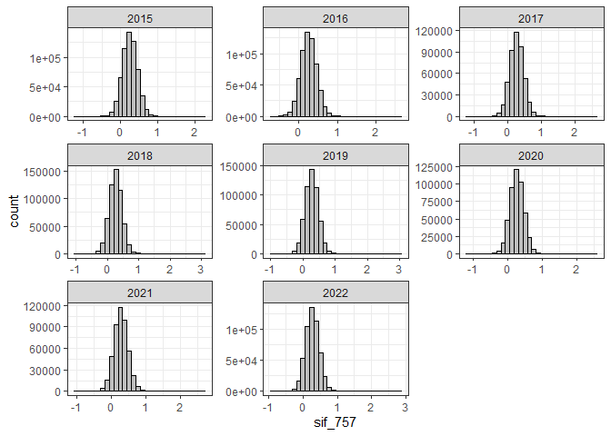<!-- -->

## **Temporal visualization**

### ***General for Brazil***

``` r

sifdf |>
  dplyr::filter(dist_sif<0.25) |> # radius (grid cell = 0.5°)
  dplyr::filter(year %in% 2015:2022) |>
  dplyr::group_by(year,date) |>
  dplyr::summarise(sif=mean(sif_757)) |>
  ggplot2::ggplot(ggplot2::aes(x=date,y=sif))+
  ggplot2::geom_point(shape=21,color="black",fill="gray") +
  ggplot2::geom_line(color="red")+
  ggplot2::geom_smooth(method = "lm") +
  #ggplot2::ylim(390,420)+
  ggpubr::stat_regline_equation(ggplot2::aes(
                                  label =  paste(..eq.label.., ..rr.label..,
                                                 sep = "*plain(\",\")~~")),
                               # label.y = 420
                               ) +
  #ggplot2::facet_wrap(~year,scales ='free')+
  ggplot2::theme_bw()+
  ggplot2::labs(x='',y=expression('SIF 757nm (Wm'^-2~'sr'^-1~mu~'m'^-1~')'),fill='' )
```

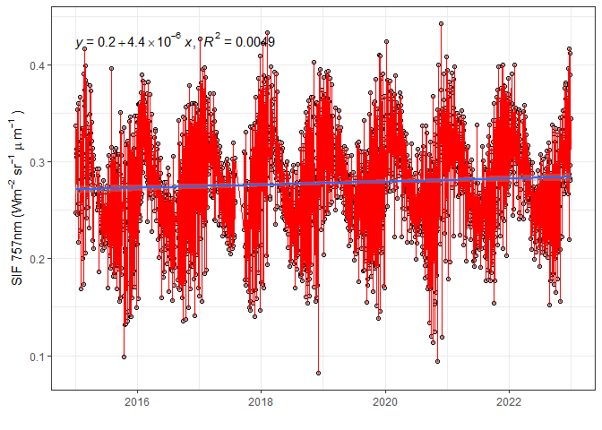<!-- -->

## **Pré-processing**

``` r

sifdf_filter <- sifdf |>
  #dplyr::filter(year == 2015) |>
  dplyr::filter(dist_sif<0.25) |>
  dplyr::mutate(
    lon = lon_grid,
    lat = lat_grid,
  ) |>
  dplyr::select(-c(lon_grid,lat_grid)) |>
  dplyr::group_by(lon,lat,year,month) |>
  dplyr::summarise(
    sif_mean= mean(sif_757,na.rm=TRUE),
    sif_sd = sd(sif_757,na.rm=TRUE),
    sza = mean(sza),
    nobs = dplyr::n(),
    sif_ep = sif_sd/sqrt(nobs),
    cv = 100*sif_sd/sif_mean
  ) |>
  dplyr::mutate(
    date = lubridate::make_date(year,month,'15')
  )

### SIF medians for the period in per grid cell basis
sif_medians <- sifdf_filter |>
  dplyr::group_by(lon,lat) |>
  dplyr::summarise(
    sif_median = median(sif_mean)
  )
```

## **SIF normalized**

``` r
south_america |>
  ggplot2::ggplot()+
  ggspatial::annotation_map_tile(type = 'cartolight')+
  ggplot2::geom_sf(col='grey',fill='white')+
  ggplot2::geom_sf(data=br,col='red',fill='NA')+
  ggplot2::ylim(-35,5.5)+
  ggplot2::xlim(-75,-35)+
  ggplot2::geom_tile(data=
                       sifdf_filter |>
                       dplyr::select(lon, lat, date,sif_mean) |>
                       dplyr::left_join(sif_medians) |>
                       dplyr::group_by(lon,lat) |>
                       dplyr::mutate(
                         sif_norm= (sif_mean - sif_median)/sif_median,
                         year=lubridate::year(date)
                       ) |>
                       dplyr::group_by(lon,lat,year) |>
                       dplyr::summarise(
                         sif=mean(sif_norm)
                       ) |>
                       dplyr::mutate(
                         sif_class = ifelse(sif<=0,'Decreasing', 'Enhancement')
                       ) |> dplyr::filter(year!=2023),
                     ggplot2::aes(x=lon,y=lat,fill=sif_class),
  )+
  ggplot2::facet_wrap(~year)+
  ggplot2::theme(axis.text = ggplot2::element_text(size=12),
                 axis.title = ggplot2::element_text(size=20),
                 text = ggplot2::element_text(size=20))+
  map_theme_2()+
  ggplot2::scale_fill_manual(values = c('darkred','darkgreen'))+
  ggplot2::labs(x='Longitude',y='Latitude',fill=expression('SIF'[Norm]))
```

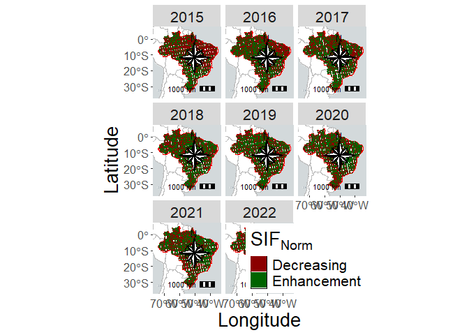<!-- -->

``` r

# ggplot2::ggsave('img/sif_norm_all.png',units="in", width=11, height=11,
#                 dpi=300)
```

# **Relationship between SIF norm and Beta**

``` r
sif_proce <- sifdf_filter |>
  dplyr::select(lon, lat, date,sif_mean) |>
  dplyr::left_join(sif_medians) |>
  dplyr::group_by(lon,lat) |>
  dplyr::mutate(
    sif_norm= (sif_mean - sif_median)/sif_median,
    year=lubridate::year(date)
  ) |>
  dplyr::group_by(lon,lat,year) |>
  dplyr::summarise(
    sif=mean(sif_norm)
  ) |>
  dplyr::mutate(
    sif_class = ifelse(sif<=0,'Decreasing', 'Enhancement')
  )


## read beta data frame if is not in the environment 

# dfall <- readxl::read_excel("output/beta_significant.xlsx")
```

``` r


br |>
  ggplot2::ggplot()+
  ggplot2::geom_sf(fill="white", color="black",
                   size=.15, show.legend = FALSE)+
  ggplot2::geom_tile(data=dfall |> 
                       dplyr::filter(xco2!="Non Significant") |> 
                       dplyr::select(lon,lat,year,beta_line,xco2) |> 
                       dplyr::left_join(sif_proce) |>
                       dplyr::filter(sif_class=='Enhancement'&xco2=='Sink'),
                     ggplot2::aes(x=lon,y=lat,fill=as.factor(year)),
  )+
  map_theme_2()+
  ggplot2::scale_fill_viridis_d()+
  ggplot2::labs(x='Longitude',y='Latitude',fill=expression(''))
```

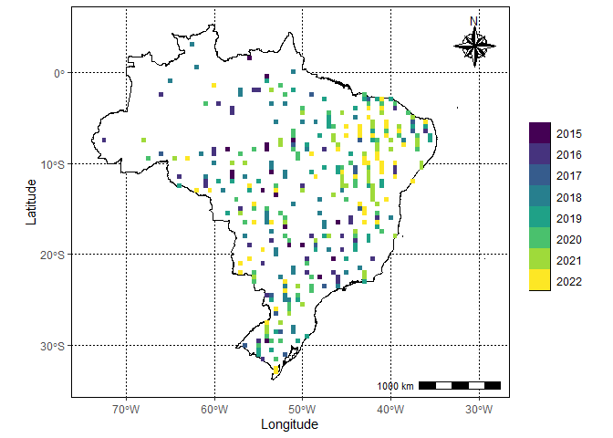<!-- -->

### **linear regression by month for brazil**

``` r
mod <- lm(xco2_mean~x,data =xco2df_rationality |>
            dplyr::mutate(
              x = 1:dplyr::n()
            ))
xco2df_rationality |>
  dplyr::filter(lubridate::year(date)<2023) |>
  dplyr::mutate(
    x=1:dplyr::n(),
    xco2_est = mod$coefficients[1] + mod$coefficients[2]*x,
    delta=xco2_est - xco2_mean,
    xco2r = (mod$coefficients[1]-delta)-(mean(xco2_mean)-mod$coefficients[1])
  ) |>
  dplyr::group_by(date) |>
  dplyr::summarise(xco2_mean=mean(xco2r)) |>
  dplyr::left_join(df_stat_desc_sif |> 
                     dplyr::select(date,MEAN) |> 
                     dplyr::rename(sif=MEAN)) |> 
  ggplot2::ggplot(ggplot2::aes(x=sif,y=xco2_mean))+
  ggplot2::geom_point()+
  ggplot2::geom_smooth(method = "lm")+
  ggpubr::stat_regline_equation(ggplot2::aes(
    label =  paste(..eq.label.., ..rr.label.., sep = "*plain(\",\")~~"))) +
  ggplot2::theme_bw()+
  ggplot2::theme(
    axis.text = ggplot2::element_text(color='black'),
    axis.ticks = ggplot2::element_line(color='black')
  )+
  ggplot2::xlab(expression(
    'SIF 757nm (Wm'^-2~'sr'^-1~mu~'m'^-1~')'))+
  ggplot2::ylab(expression(
    'Xco'[2][R]~' (ppm)'
  ))
```

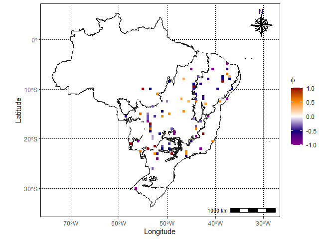<!-- -->
