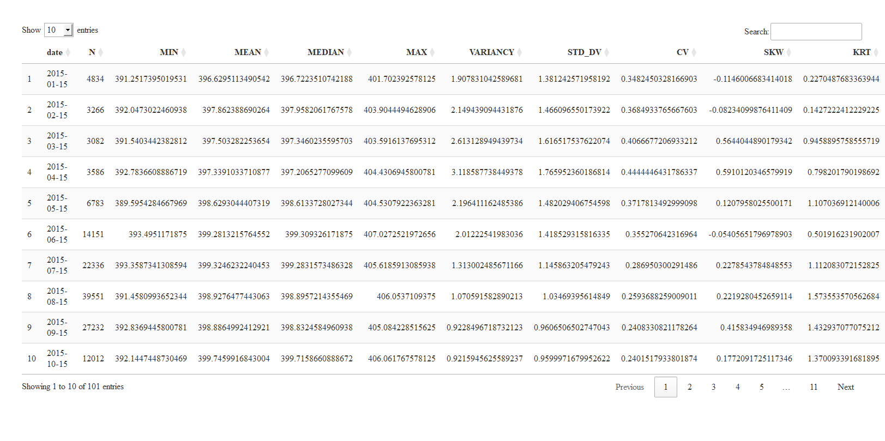

# 

## **XCO2 download and pre-processing**

### **Download**

``` r
# url_filename <- list.files("url/",
#                             pattern = ".txt",
#                             full.names = TRUE)
# 
# urls <- read.table(url_filename) |>
#   dplyr::filter(!stringr::str_detect(V1,".pdf"))
# n_urls <- nrow(urls)
# 
# ### Download
# tictoc::tic()
# furrr::future_pmap(list(urls[,1],"input your user","your password"),my_ncdf4_download)
# tictoc::toc()
```

### **Extraction**

``` r
# files_names <- list.files("data-raw/",
#                           pattern = "nc",
#                           full.names = TRUE)
# 
# #### Extracting
# 
# xco2 <- purrr::map_df(files_names, my_ncdf4_extractor) |>
#   dplyr::mutate(
#     date = as.Date.POSIXct(time)
#   )
# dplyr::glimpse(xco2)

# ### Saving full data

# readr::write_rds(xco2,'data/xco2_full.rds')
```

### **Aggregation**

``` r
# Expand grid for brazil
#
##
# dist <- 0.5
# grid_br <- expand.grid(lon=seq(-74,
#                                -27,dist),
#                        lat=seq(-34,
#                                6,
#                                dist))
# plot(grid_br)
# 
# 
# br <- geobr::read_country(showProgress = FALSE)
# region <- geobr::read_region(showProgress = FALSE)
# 
# pol_br <- br$geom |> purrr::pluck(1) |> as.matrix()
# pol_north <- region$geom |> purrr::pluck(1) |> as.matrix()
# pol_northeast <- region$geom |> purrr::pluck(2) |> as.matrix()
# pol_southeast <- region$geom |> purrr::pluck(3) |> as.matrix()
# pol_south <- region$geom |> purrr::pluck(4) |> as.matrix()
# pol_midwest<- region$geom |> purrr::pluck(5) |> as.matrix()
# 
# # correcting poligions
# 
# pol_br <- pol_br[pol_br[,1]<=-34,]
# pol_br <- pol_br[!((pol_br[,1]>=-38.8 & pol_br[,1]<=-38.6) &
#                      (pol_br[,2]>= -19 & pol_br[,2]<= -16)),]
# 
# pol_northeast <- pol_northeast[pol_northeast[,1]<=-34,]
# pol_northeast <- pol_northeast[!((pol_northeast[,1]>=-38.7 &
#                                     pol_northeast[,1]<=-38.6) &
#                                    pol_northeast[,2]<= -15),]
# 
# pol_southeast <- pol_southeast[pol_southeast[,1]<=-30,]
# 
# 
# ### filtering expanded grid to the brazil boundries
# 
# grid_br_cut <- grid_br |>
#   dplyr::mutate(
#     flag_br = def_pol(lon,lat,pol_br),
#     flag_north = def_pol(lon,lat,pol_north),
#     flag_northeast = def_pol(lon,lat,pol_northeast),
#     flag_midwest= def_pol(lon,lat,pol_midwest),
#     flag_southeast = def_pol(lon,lat,pol_southeast),
#     flag_south = def_pol(lon,lat,pol_south)
#   ) |>
#   tidyr::pivot_longer(
#     tidyr::starts_with('flag'),
#     names_to = 'region',
#     values_to = 'flag'
#   ) |>
#   dplyr::filter(flag) |>
#   dplyr::select(lon,lat) |>
#   dplyr::group_by(lon,lat) |>
#   dplyr::summarise(
#     n_obs = dplyr::n()
#   )
# 
# plot(grid_br_cut$lon,grid_br_cut$lat)
# 
# 
# #### aggregation
# xco2df <- readr::read_rds('data/xco2_full.rds')
# 
# xco2_full_trend <- xco2df |> dplyr::mutate(
#   year =lubridate::year(date),
#   month = lubridate::month(date)
# )
# 
# max(xco2_full_trend$year)
# 
# 
# for(i in 2015:2023){
#   aux_xco2 <- xco2_full_trend |>
#     dplyr::filter(year==i)
#   vct_xco2 <- vector();dist_xco2 <- vector();
#   lon_grid <- vector();lat_grid <- vector();
#   for(k in 1:nrow(aux_xco2)){
#     d <- sqrt((aux_xco2$lon[k]-grid_br_cut$lon)^2+
#                 (aux_xco2$lat[k]-grid_br_cut$lat)^2
#     )
#     min_index <- order(d)[1]
#     vct_xco2[k] <- aux_xco2$xco2[min_index]
#     dist_xco2[k] <- d[order(d)[1]]
#     lon_grid[k] <- grid_br_cut$lon[min_index]
#     lat_grid[k] <- grid_br_cut$lat[min_index]
#   }
#   aux_xco2$dist_xco2 <- dist_xco2
#   aux_xco2$xco2_new <- vct_xco2
#   aux_xco2$lon_grid <- lon_grid
#   aux_xco2$lat_grid <- lat_grid
#   if(i == 2015){
#     xco2_full_trend_cut <- aux_xco2
#   }else{
#     xco2_full_trend_cut <- rbind(xco2_full_trend_cut,aux_xco2)
#   }
# }
# 
# 
# xco2_full_trend_cut|>
#   dplyr::mutate(
#     dist_conf = sqrt((lon - lon_grid)^2 + (lat - lat_grid)^2)
#   ) |>
#   dplyr::glimpse()
# 
# nrow(xco2_full_trend_cut |>
#        dplyr::mutate(
#          dist_conf = sqrt((lon - lon_grid)^2 + (lat - lat_grid)^2),
#          dist_bol = dist_xco2 - dist_conf
#        ) |>
#        dplyr::filter(dist_bol ==0)) == nrow(xco2_full_trend_cut)
# 
# ### Saving aggregated data
# readr::write_rds(xco2_full_trend_cut,'data/xco2_0.5deg_full_trend.rds')
```

## **Loading internal functions**

``` r
functions_files <- list.files('r/functions/',full.names = T)
purrr::map(functions_files,source)
```

## **Loading data and shps**

``` r
br <- geobr::read_country(showProgress = FALSE)
south_file <- list.files('South_America/',pattern = 'shp',full.names = T)
south_america <- sf::read_sf(south_file[1])
biomes <- geobr::read_biomes(showProgress = FALSE)

xco2df <- readr::read_rds('data/xco2_0.5deg_full_trend.rds')
```

## **Temporal visualization**

### ***Geral Brazil***

``` r

xco2df |>
  dplyr::filter(dist_xco2<0.25) |> # radius (grid cell = 0.5°)
  dplyr::filter(year %in% 2015:2022) |>
  dplyr::group_by(year,date) |>
  dplyr::summarise(xco2_mean=mean(xco2)) |>
  ggplot2::ggplot(ggplot2::aes(x=date,y=xco2_mean))+
  ggplot2::geom_point(shape=21,color="black",fill="gray") +
  ggplot2::geom_line(color="red")+
  ggplot2::geom_smooth(method = "lm") +
  ggplot2::ylim(390,420)+
  ggpubr::stat_regline_equation(ggplot2::aes(
                                  label =  paste(..eq.label.., ..rr.label..,
                                                 sep = "*plain(\",\")~~")),
                                label.y = 420) +
  ggplot2::facet_wrap(~year,scales ='free')+
  ggplot2::theme_bw()+
  ggplot2::labs(x='',y=expression('Xco'[2]~' (ppm)'),fill='' )
```

<!-- -->

``` r


# ggplot2::ggsave('img/xco2_temporal_ano.png',units="in", width=10, height=7,
#                 dpi=300)
```

### ***Rationality***

``` r
xco2df_rationality <- xco2df |>
  dplyr::filter(dist_xco2<0.25) |>
  dplyr::mutate(
    lon = lon_grid,
    lat = lat_grid,
  ) |>
  dplyr::filter(lon == -50, lat ==-19) |>
  dplyr::select(-c(lon_grid,lat_grid)) |>
  dplyr::group_by(lon,lat,year,month) |>
  dplyr::summarise(
    xco2_mean= mean(xco2,na.rm=TRUE),
    xco2_sd = sd(xco2,na.rm=TRUE),
    xco2_uncertanty = mean(uncertanty),
    nobs = dplyr::n(),
    xco2_ep = xco2_sd/sqrt(nobs),
    cv = 100*xco2_sd/xco2_mean
  ) |>
  dplyr::mutate(
    date = lubridate::make_date(year,month,'15')
  )
mod <- lm(xco2_mean~x,data =xco2df_rationality |>
            dplyr::mutate(
              x = 1:dplyr::n()
            ))
xco2df_rationality |>
  dplyr::filter(lubridate::year(date)<2023) |>
  dplyr::mutate(
    x=1:dplyr::n(),
    xco2_est = mod$coefficients[1] + mod$coefficients[2]*x,
    delta=xco2_est - xco2_mean,
    xco2r = (mod$coefficients[1]-delta)-(mean(xco2_mean)-mod$coefficients[1])
  ) |>
  dplyr::group_by(date) |>
  dplyr::summarise(xco2_mean=mean(xco2r)) |>
  ggplot2::ggplot(ggplot2::aes(x=date,y=xco2_mean )) +
  ggplot2::geom_point(shape=21,color="black",fill="gray") +
  ggplot2::geom_line(color="red") +
  ggplot2::geom_smooth(method = "lm") +
  ggpubr::stat_regline_equation(ggplot2::aes(
    label =  paste(..eq.label.., ..rr.label.., sep = "*plain(\",\")~~"))) +
  ggplot2::facet_wrap(~lubridate::year(date),scales = 'free_x')+
  ggplot2::theme_bw()+
  ggplot2::xlab('Month')+
  ggplot2::ylab(expression(
    'Xco'[2][R]~' (ppm)'
  ))
```

<!-- -->

``` r

# ggplot2::ggsave('img/rationality_beta.png',units="in", width=8, height=6,
#                dpi=300)
```
